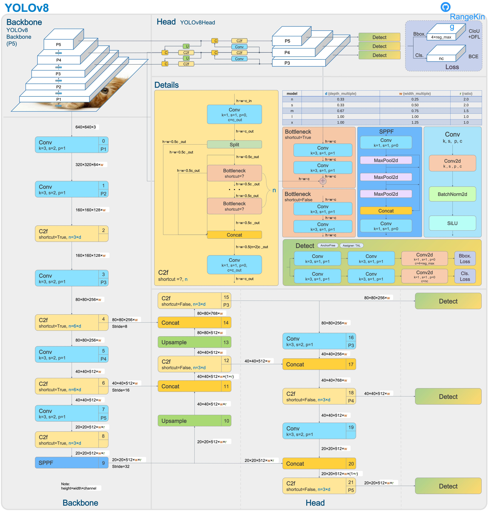
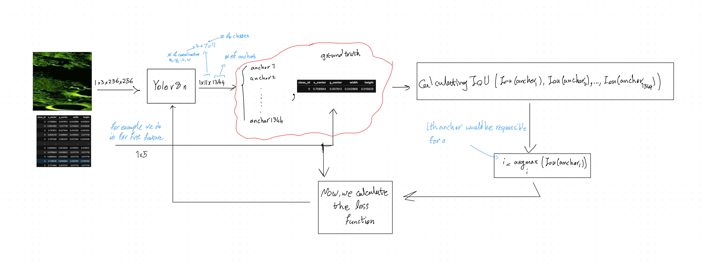

# YOLOv8 Moon Recognition - Code Overview

This folder contains the core implementation files for training a YOLOv8-based object detection model for moon crater/feature recognition.

## Files

### `model.py`
A from-scratch PyTorch implementation of the YOLOv8n architecture. It defines all building blocks: `Conv` (conv + BN + SiLU), `Bottleneck`, `C2f` (CSP bottleneck), `SPPF` (spatial pyramid pooling), `Concat`, `DFL` (distribution focal loss), and `Detect` (detection head). These are assembled into `DetectionModel`, a full YOLOv8n model with 3.01M parameters.

### `HowTotrain.ipynb`
A step-by-step tutorial notebook showing the training pipeline. It loads the custom `DetectionModel`, runs inference on one example image from the dataset, computes IoU to find the best-matching prediction, defines a simple custom loss (MSE for box coordinates, BCE for class probabilities), and trains for 2 epochs on a single example.

### `preprocessing.ipynb`
Data preparation notebook. It provides `mask_to_yolo_boxes_multi()` which converts binary segmentation masks into YOLO-format bounding boxes via connected-component labeling. The notebook then processes `.npz` files (3-channel images + 7-class masks), extracts all bounding boxes into a CSV, splits into train/val (80/20), converts to PNG images with YOLO `.txt` labels, and generates a `data.yaml` config file for Ultralytics training.

### `run.py`
The actual training notebook using the Ultralytics YOLOv8 library. It loads a pretrained `yolov8n.pt` checkpoint, adapts it for 7 classes, and trains for 100 epochs on the dataset produced by `preprocessing.ipynb`. Full training logs are shown, including per-epoch losses (box, cls, dfl) and validation metrics (Precision, Recall, mAP50, mAP50-95).

### `predict folders`
There are simple script codes to predict the lunar features of south pole of the moon.

### `SouthPole.ipynb`
extracting and analysing the prediction of the features over the south pole of the moon.

### `make_image.ipynb`
The script code to convert the mosaic images of moon to the large scale of all lunar surface of moon.

### `ExtractInfo.ipynb`
This script code use the 2D FFT and SVD to validate the yolo prediction of lunar surface.

### `lunar_surface.pdf`
report all I did for using and justifying the yolo models to detect the features of lunar surface.

## Pipeline

1. `preprocessing.ipynb` converts raw `.npz` mask data into a YOLO-format dataset (images + labels + `data.yaml`)
2. `HowTotrain.ipynb` demonstrates a minimal training loop (conceptual walkthrough)
3. `training.ipynb` runs the full 100-epoch training using Ultralytics YOLOv8
